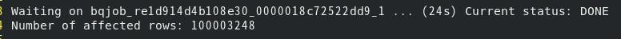
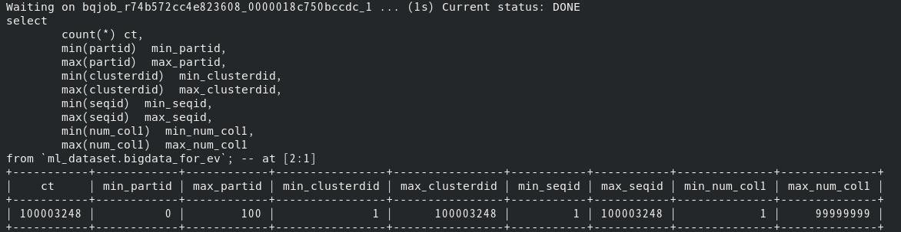
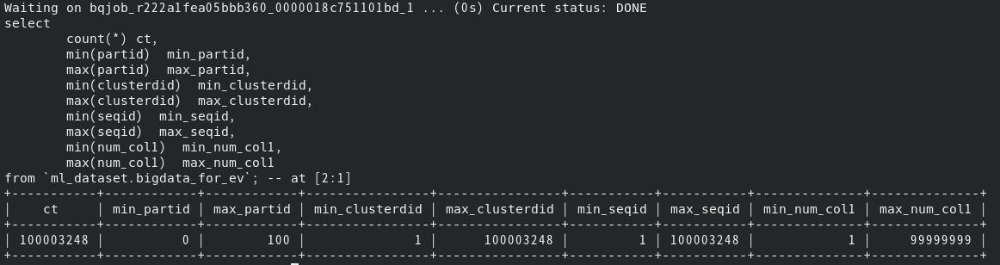

<br><br><br> 
# ##機能概要
Bigqueryは大量データを処理するが性能検証用にテストデータを作成するのは大変である。
そこで、Bigqueryで大量データを生成するSQLを作成した。
SQL一発で作成するので非常に高速。またシンプルなので柔軟にカスタマイズ可能。

<br><br><br> 
# ##以降で説明するコードの全体像
```
#パーティションテーブル作成
#テーブル作成
bq rm -t ml_dataset.bigdata_for_ev
bq mk -t --schema ./schema/bigdata_for_ev_schema.json \
--require_partition_filter=false  \
--range_partitioning=partid,0,1000,1 \
--clustering_fields=clusterdid \
ml_dataset.bigdata_for_ev

#データ削除&データ生成
bq query --use_legacy_sql=false 'delete from `ml_dataset.bigdata_for_ev` where partid !=-1'
bq query --use_legacy_sql=false   <gen_bigdata.sql


#非パーティションテーブル作成(おまけ）
#テーブル作成
bq rm -t ml_dataset.bigdata_for_ev_nopart
bq mk -t --schema ./schema/bigdata_for_ev_schema.json \
--require_partition_filter=false  \
--clustering_fields=clusterdid \
ml_dataset.bigdata_for_ev_nopart

#データ削除&データ生成
bq query --use_legacy_sql=false 'delete from `ml_dataset.bigdata_for_ev_nopart` where partid !=-1'
bq query --use_legacy_sql=false 'insert into `ml_dataset.bigdata_for_ev_nopart` select * from `ml_dataset.bigdata_for_ev`'

#確認
bq query --use_legacy_sql=false <  query.sql
```


<br><br><br> 
# ##データ生成手順

## テーブル作成


```
bq rm -t ml_dataset.bigdata_for_ev

bq mk -t --schema ./schema/bigdata_for_ev_schema.json \
--require_partition_filter=false  \
--range_partitioning=partid,0,1000,1 \
--clustering_fields=clusterdid \
ml_dataset.bigdata_for_ev
```

上記ではパーティション＆クラスタリング構成のテーブルを作成している。

[パーティション＆クラスタリングテーブル](./schema/bigdata_for_ev_schema.json)
   
スキーマ情報は上記のとおり。
検証内容に応じて任意の型や項目名に変更する。


<br><br><br> 

## データ生成

既にデータが存在して削除する場合は下記を実行する。
```
bq query --use_legacy_sql=false 'delete from `ml_dataset.bigdata_for_ev` where partid !=-1'
```

データを生成するSQLを実行


```
bq query --use_legacy_sql=false <gen_bigdata.sql
```

[データを生成するSQL](./gen_bigdata.sql)


下記SQLを実行している。

```
INSERT INTO `ml_dataset.bigdata_for_ev` 
SELECT
	cast(ROW_NUMBER() OVER() /100000  as integer) -- パーティションキー
	,ROW_NUMBER() OVER()                          -- クラスタリング項目
	,ROW_NUMBER() OVER()                          -- 通常の数値項目1
	,cast(rand()*100000000 as integer)            -- 通常の数値項目2 
	,cast(cast(rand()*1 as integer) as string) 
	,cast(cast(rand()*10 as integer) as string) 
	,cast(cast(rand()*100 as integer) as string) 
	,cast(cast(rand()*1000 as integer) as string) 
	,cast(cast(rand()*10000 as integer) as string) 
	,cast(cast(rand()*100000 as integer) as string) 
FROM 
	UNNEST(GENERATE_ARRAY(1, 21627)),
	`ml_dataset`.INFORMATION_SCHEMA.COLUMNS a,
	`ml_dataset`.INFORMATION_SCHEMA.COLUMNS b;
```

***説明***

今回は性能検証を目的に下記のようにデータを生成している。目的に合わせてカスタマイズしてください。
- ROW_NUMBER() OVER()で連番を生成している。
- パーティションキーは100000で割ることで1000個のパーティションにデータが分散するように生成している。
- クラスタリング項目は連番として生成している。
- 通常の数値項目1は連番として生成している。
- 通常の数値項目2は乱数関数で1億個にランダムに分散するようにしている。
- その他の項目は作りたいカーディナリティに合わせて乱数に数字を掛け合わせている。

生成するデータ件数のコントロールについて

FROM句ではGENERATE_ARRAYで生成したレコードとINFORMATION_SCHEMA(システムテーブル）を直積で結合することで
データを発生させている。GENERATE_ARRAY × aの件数 × bの件数 の件数で生成される。
GENERATE_ARRAYのみで実現できると思っていたがリソースオーバーで落るのでこの方式とした。
ここでは約1億件のレコードを生成させている。


# ##データ生成結果
下記のとおり約1億件を30秒程度で生成している。


下記のとおり目的どおりのデータが生成されている。


[カウント用SQL](./query.sql)


# ##おまけ

上記で作成したデータを非パーティション処理にselect＆insertで一括で投入する。

## テーブル作成

```
bq rm -t ml_dataset.bigdata_for_ev_nopart

bq mk -t --schema ./schema/bigdata_for_ev_schema.json \
--require_partition_filter=false  \
--clustering_fields=clusterdid \
ml_dataset.bigdata_for_ev_nopart

```

## データ生成


既にデータが存在して削除する場合は下記を実行する。

#bq query --use_legacy_sql=false 'delete from `ml_dataset.bigdata_for_ev_nopart` where partid !=-1'

データを生成するSQLを実行

```
bq query --use_legacy_sql=false 'insert into `ml_dataset.bigdata_for_ev_nopart` select * from `ml_dataset.bigdata_for_ev`'
```

# ##データ生成結果
下記のとおり約1億件を15秒程度で生成している。


下記のとおり目的どおりのデータが生成されている。



