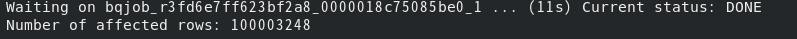
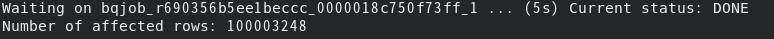

<br><br><br> 
# ##機能概要
Bigqueryは大量データを処理するが性能検証用にテストデータを作成するのは大変である。
そこで、Bigqueryで大量データを生成するSQLを作成した。
SQL一発で作成するので非常に高速。またシンプルなので柔軟にカスタマイズ可能。

<br><br><br> 
# ##以降で説明するコードの全体像
```
#パーティションテーブル作成
#テーブル作成
bq rm -t ml_dataset.bigdata_for_ev
bq mk -t --schema ./schema/bigdata_for_ev_schema.json \
--require_partition_filter=false  \
--range_partitioning=partid,0,100,1 \
--clustering_fields=clusterdid \
ml_dataset.bigdata_for_ev

#データ削除&データ生成
bq query --use_legacy_sql=false 'delete from `ml_dataset.bigdata_for_ev` where partid !=-1'
bq query --use_legacy_sql=false   <gen_bigdata.sql


#非パーティションテーブル作成(おまけ）
#テーブル作成
bq rm -t ml_dataset.bigdata_for_ev_nopart
bq mk -t --schema ./schema/bigdata_for_ev_schema.json \
--require_partition_filter=false  \
--clustering_fields=clusterdid \
ml_dataset.bigdata_for_ev_nopart

#データ削除&データ生成
bq query --use_legacy_sql=false 'delete from `ml_dataset.bigdata_for_ev_nopart` where partid !=-1'
bq query --use_legacy_sql=false 'insert into `ml_dataset.bigdata_for_ev_nopart` select * from `ml_dataset.bigdata_for_ev`'

#確認
bq query --use_legacy_sql=false <  query.sql
```


<br><br><br> 
# ##データ生成手順

## テーブル作成


```
bq rm -t ml_dataset.bigdata_for_ev

bq mk -t --schema ./schema/bigdata_for_ev_schema.json \
--require_partition_filter=false  \
--range_partitioning=partid,0,100,1 \
--clustering_fields=clusterdid \
ml_dataset.bigdata_for_ev
```

上記ではパーティション＆クラスタリング構成のテーブルを作成している。

[パーティション＆クラスタリングテーブル:schema/bigdata_for_ev_schema.json](./schema/bigdata_for_ev_schema.json)
   
スキーマ情報は上記のとおり。
検証内容に応じて任意の型や項目名に変更してください。


<br><br><br> 

## データ生成

既にデータが存在して削除する場合は下記を実行する。
```
bq query --use_legacy_sql=false 'delete from `ml_dataset.bigdata_for_ev` where partid !=-1'
```

データを生成するSQLを実行


```
bq query --use_legacy_sql=false <gen_bigdata.sql
```

[データを生成するSQL:gen_bigdata.sql](./gen_bigdata.sql)


下記SQLを実行している。

```
INSERT INTO `ml_dataset.bigdata_for_ev` 
SELECT
	cast(ROW_NUMBER() OVER() /1000000  as integer) -- パーティションキー
	,ROW_NUMBER() OVER()                          -- クラスタリング項目
	,ROW_NUMBER() OVER()                          -- 通常の数値項目1
	,cast(rand()*100000000 as integer)            -- 通常の数値項目2 
	,cast(cast(rand()*1 as integer) as string) 
	,cast(cast(rand()*10 as integer) as string) 
	,cast(cast(rand()*100 as integer) as string) 
	,cast(cast(rand()*1000 as integer) as string) 
	,cast(cast(rand()*10000 as integer) as string) 
	,cast(cast(rand()*100000 as integer) as string) 
FROM 
	UNNEST(GENERATE_ARRAY(1, 21627)),
	`ml_dataset`.INFORMATION_SCHEMA.COLUMNS a,    -- この環境ではINFORMATION_SCHEMA.COLUMNS68件
	`ml_dataset`.INFORMATION_SCHEMA.COLUMNS b;
```

***説明***

今回は性能検証を目的に下記のようにデータを生成している。目的に合わせてカスタマイズしてください。
- ROW_NUMBER() OVER()で連番を生成している。
- パーティションキーは1000000で割ることで100個のパーティションにデータが分散するように生成している。
- クラスタリング項目は連番として生成している。
- 通常の数値項目1は連番として生成している。
- 通常の数値項目2は乱数関数で1億個にランダムに分散するようにしている。
- その他の項目は作りたいカーディナリティに合わせて乱数に数字を掛け合わせている。

生成するデータ件数のコントロールについて

FROM句ではGENERATE_ARRAYで生成したレコードとINFORMATION_SCHEMA(システムテーブル）を直積で結合することで
データを発生させている。GENERATE_ARRAY × aの件数 × bの件数 の件数で生成される。
GENERATE_ARRAYのみで実現できると思っていたがリソースオーバーで落るのでこの方式とした。
ここでは約1億件のレコードを生成させている。
尚、INFORMATION_SCHEMA.COLUMNS以外のテーブルを指定しても良い。
※ この環境ではINFORMATION_SCHEMA.COLUMNSは68件。各環境によって件数は異なるので注意してください。


# ##データ生成結果
下記のとおり約1億件を10秒程度で生成している。


下記のとおり目的どおりのデータが生成されている。


[カウント用SQL:query.sql](./query.sql)


# ##おまけ

上記で作成したデータを非パーティションテーブルにselect＆insertで一括で投入する。

## テーブル作成

```
bq rm -t ml_dataset.bigdata_for_ev_nopart

bq mk -t --schema ./schema/bigdata_for_ev_schema.json \
--require_partition_filter=false  \
--clustering_fields=clusterdid \
ml_dataset.bigdata_for_ev_nopart

```

## データ生成


既にデータが存在して削除する場合は下記を実行する。

#bq query --use_legacy_sql=false 'delete from `ml_dataset.bigdata_for_ev_nopart` where partid !=-1'

データを生成するSQLを実行

```
bq query --use_legacy_sql=false 'insert into `ml_dataset.bigdata_for_ev_nopart` select * from `ml_dataset.bigdata_for_ev`'
```

# ##データ生成結果
下記のとおり約1億件を5秒程度で生成している。
ストレージからのREADがない分、直積方式の方が高速だろうと予想していた。
しかし、select&insertでコピーの方が高速であった。IOよりもCPU処理コストの方が大きい、または、
直積方式では連番を生成しているのでCPU処理部分を並列化することが困難でボトルネックが発生するためだろう。




下記のとおり目的どおりのデータが生成されている。


